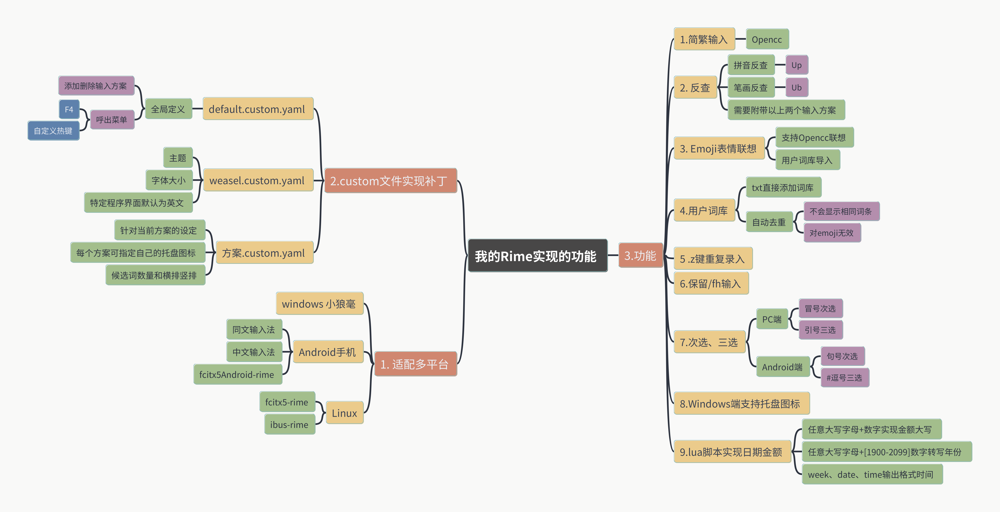
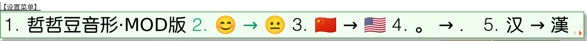
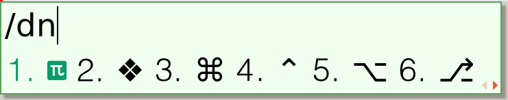
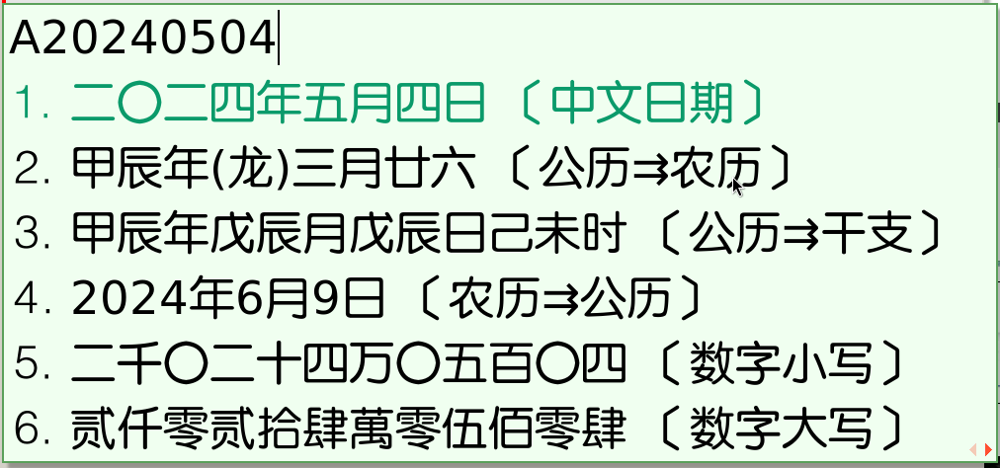

# 哲豆音形之rime配置 rime-zzdyx
两笔/二笔方案之哲豆音形的rime配置文件。

自己使用的哲豆音形输入方案在rime系输入法下的配置，经过向各方大佬的借鉴，已经实现了以下功能：

## 1. 适用平台
Windows 端：小狼毫

Android 端：fcitx5Android-rime

Linux 端：fcitx5-rime, ibus-rime

**使用方法**：直接将全部配置文件放在各平台的rime目录下，部署后即可使用。

## 2.实现功能

Mod版仅仅是定制自己的词库，其它功能和哲豆原来的三个版本是一样的。
### 2.1 简繁输入
基于 opencc 实现。  
`F4` 呼出菜单切换，也可在`方案.custom.yaml`中指定快捷键——实际上已经设定了`Ctrl+Shift+4`切换简繁输出。

### 2.2 拼音、笔画反查哲豆编码

* `Up`打开拼音反查功能。  
* `Ub`打开笔画反查功能。

需要附带`pinyin_simp`和`stroke`两个输入方案——不需要添加到输入法列表中，在rime目录下存在这两个输入法的方案和字典文件即可。

即 rime 目录下要有以下四个文件。

    pinyin_simp.dict.yaml
    pinyin_simp.schema.yaml
    stroke.dict.yaml
    stroke.schema.yaml

### 2.3 Emoji表情联想输入
基于Opencc实现。

F4 呼出的菜单中可开关。

可在`/rime/opencc/emoji_word.txt`中自己进行添加和修改。

### 2.4 可自行添加用户词库
将 rime 目录下`zzdyx_userdict_temp.txt`文件重命名为`zzdyx_userdict.txt`，并在此文件中添加用户自己的词库。

用户添加的词库居后，并已通过`〈方案〉.custom.yaml`中的`uniquifier`功能自动过滤重码。

### 2.5 z 键重复录入
哲豆方案中的 z 键基本上是没用的，于是参考五笔的习惯，实现了 z 键重复上一次输入。

### 2.6 `/+符号名`输出符号

最开始 rime 吸引我的地方就有这个大量符号输入的功能，于是尽管哲豆也给符号进行了编码方便输入，但我还是保留了`/+符号名`输出符号列表的功能。

符号名可在`rime/symbols.yaml`中查看。

### 2.7 快捷键次选和三选
兼容两个平台：
* PC端冒号和引号选择次选和三选上屏。
* 安卓端句号次选上屏，~~逗号三选上屏~~——三选不实用，暂时屏蔽了，在`〈方案〉.custom.yaml`中打开。

### 2.8 Windows端支持自定义托盘图标

**小狼毫版本0.15.0后支持此功能**

实现每个方案自定义图标，在`〈方案〉.custom.yaml`中指定。

    # 0.15.0.0后增加的系统托盘功能，仅适用于小狼毫
      "schema/icon": "icons/zzd.ico"
      "schema/ascii_icon": "icons/en.ico"

附带icons图标目录。

### 2.9 数字转日期和金额
使用 98 五笔小组的 lua 脚本实现了**任意大写字母+数字转日期和金额**功能。
* 任意大写字母+数字实现金额大写
* 任意大写字母+[1900-2099]数字转写年份
* week、date、time输出格式时间

## 3. 通过`custom`文件修改配置
可在以下三个文件中修改配置。

* default.custom.yaml：
定义一些全局功能，如呼出菜单的快捷键、手动添加删除输入法到列表等。

* weasel.custom.yaml：
在此文件中修改主题、字体大小等功能。

* 〈方案〉.custom.yaml：
针对具体方案的设定，可修改托盘图标——win端小狼毫限定，候选词数量和候选框横竖排等。

